# Flash Sale Application - Architecture & Flow Charts

This document provides comprehensive flowcharts for understanding the Flash Sale application architecture, request flows, and component interactions.

## Table of Contents
1. [High-Level Architecture](#high-level-architecture)
2. [Reservation Flow](#reservation-flow)
3. [Checkout Flow](#checkout-flow)
4. [Inventory Management Flow](#inventory-management-flow)
5. [Caching Strategy](#caching-strategy)
6. [Event-Driven Architecture](#event-driven-architecture)
7. [Database Schema](#database-schema)
8. [Component Interaction](#component-interaction)

---

## High-Level Architecture

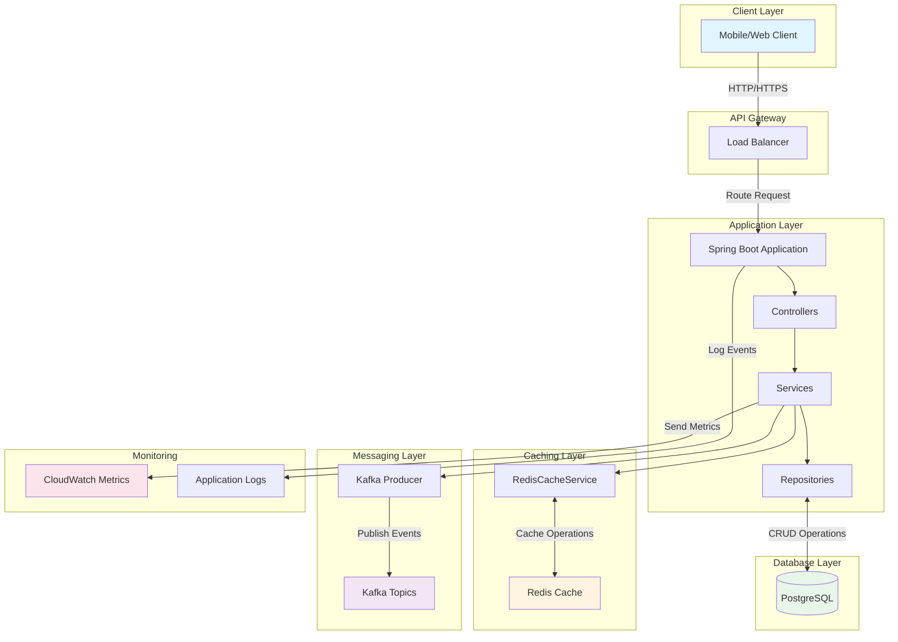

---

## Reservation Flow

### Complete Reservation Process

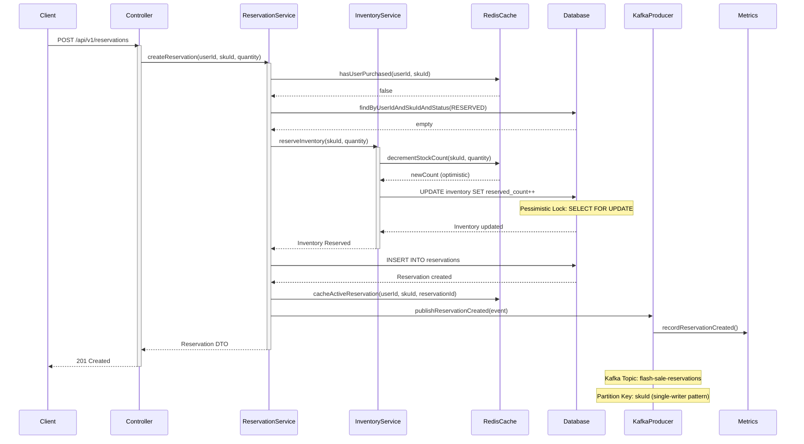

### Reservation Conflict Scenarios

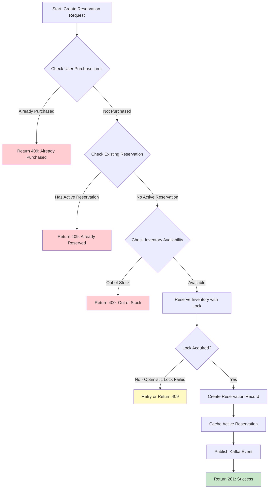

---

## Checkout Flow

### Order Checkout Process

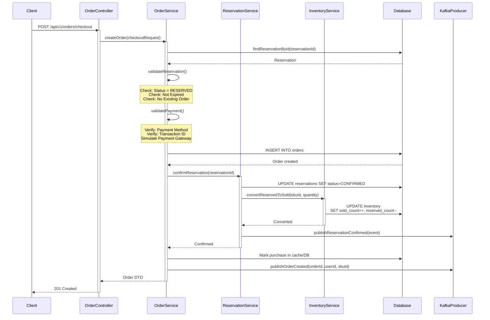

### Order State Machine

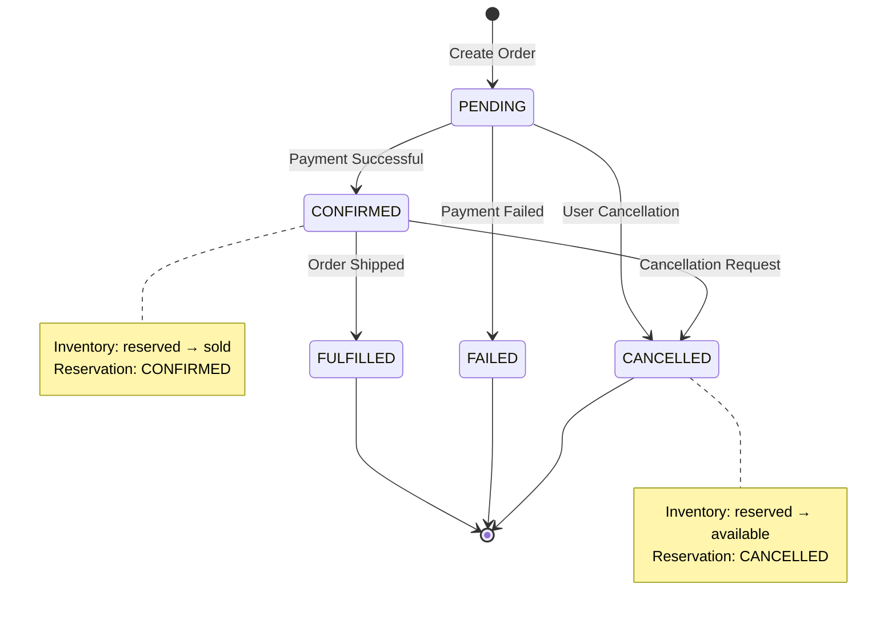

---

## Inventory Management Flow

### Inventory Update Flow

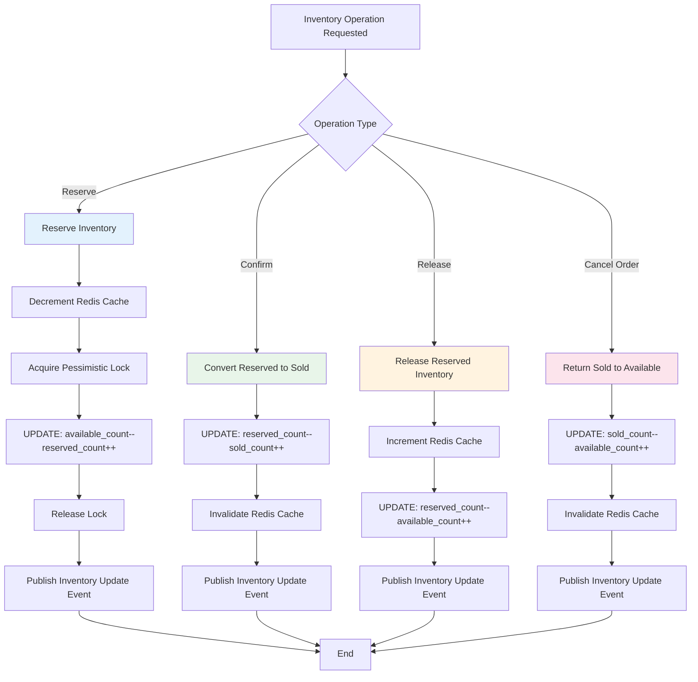

### Pessimistic Locking Strategy

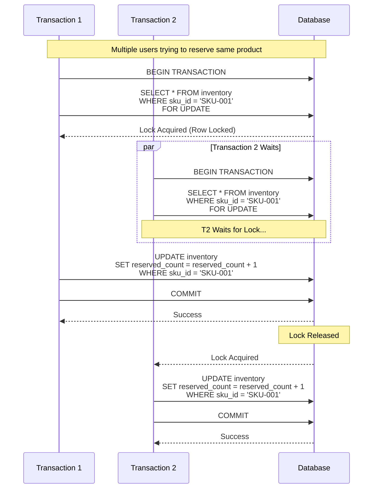

---

## Caching Strategy

### Redis Cache Flow

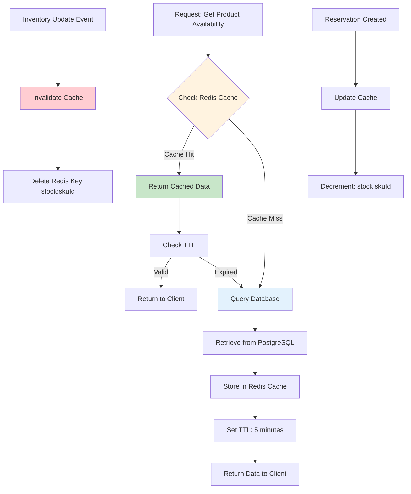

### Cache Keys and TTL

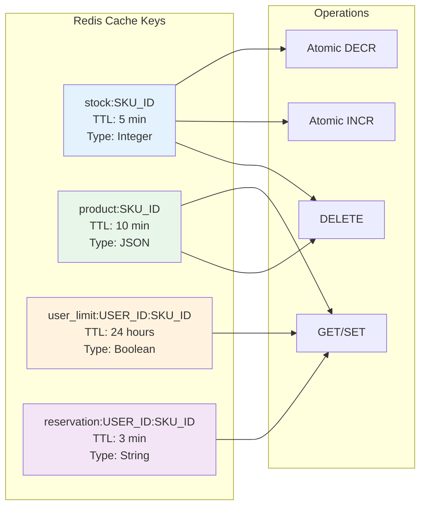

---

## Event-Driven Architecture

### Kafka Event Flow

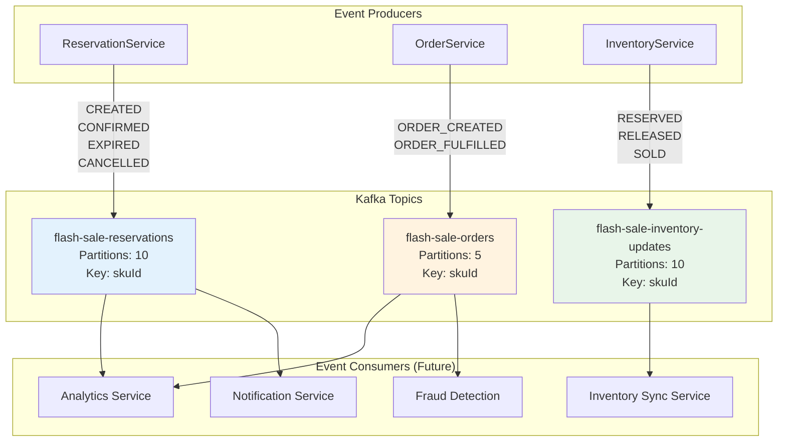

### Single-Writer Pattern

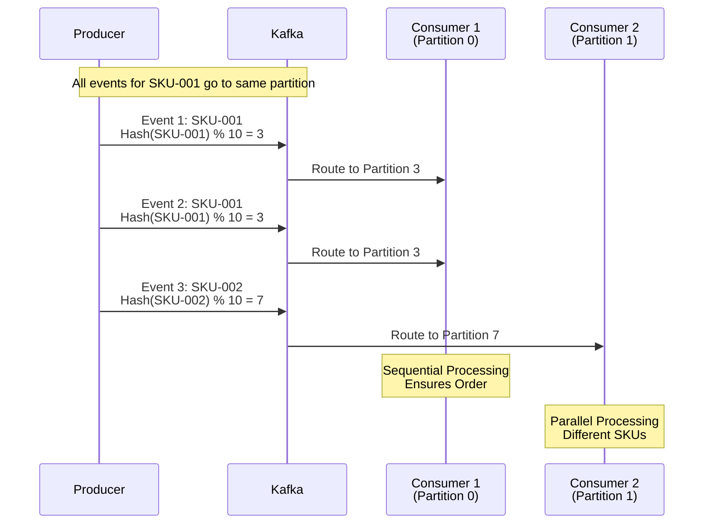

---

## Database Schema

### Entity Relationship Diagram

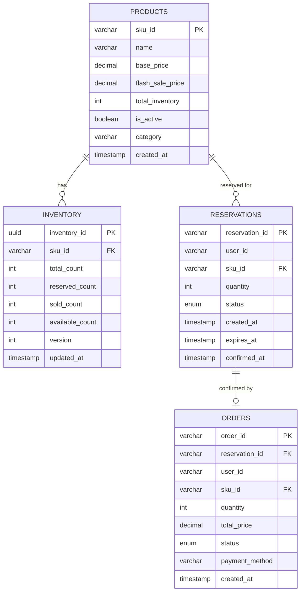

### Inventory State Calculation

```
┌─────────────────────────────────────────────────────┐
│            Inventory State                          │
├─────────────────────────────────────────────────────┤
│                                                     │
│  total_count = 100                                  │
│  ├─ reserved_count = 20  (2-min reservation)      │
│  ├─ sold_count = 30      (completed purchases)    │
│  └─ available_count = 50  (can be reserved)       │
│                                                     │
│  Formula:                                           │
│  available_count = total_count - reserved - sold   │
│                                                     │
│  ┌───────────────────────────────────────────┐    │
│  │  Optimistic Locking (JPA @Version)       │    │
│  │  - Prevents race conditions              │    │
│  │  - Retry on OptimisticLockException      │    │
│  └───────────────────────────────────────────┘    │
│                                                     │
│  ┌───────────────────────────────────────────┐    │
│  │  Pessimistic Locking (SELECT FOR UPDATE) │    │
│  │  - Critical section protection           │    │
│  │  - Ensures serial access per SKU         │    │
│  └───────────────────────────────────────────┘    │
└─────────────────────────────────────────────────────┘
```

---

## Component Interaction

### Layered Architecture

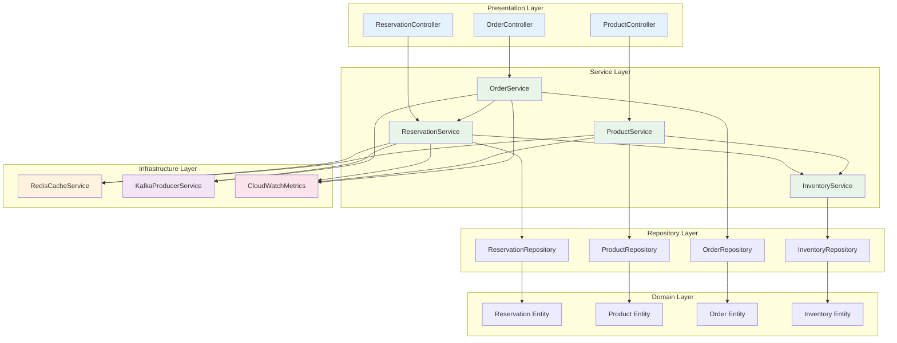

### Request Processing Flow

```
┌──────────────────────────────────────────────────────────────┐
│                     HTTP Request Flow                        │
└──────────────────────────────────────────────────────────────┘
                            │
                            ▼
              ┌─────────────────────────┐
              │   DispatcherServlet     │
              └─────────────────────────┘
                            │
                            ▼
              ┌─────────────────────────┐
              │   @RestController       │
              │   - Request Validation  │
              │   - @RequestBody bind   │
              └─────────────────────────┘
                            │
                            ▼
              ┌─────────────────────────┐
              │   @Service Layer        │
              │   - Business Logic      │
              │   - Transaction Mgmt    │
              │   - Cache Operations    │
              └─────────────────────────┘
                            │
                    ┌───────┴───────┐
                    ▼               ▼
        ┌──────────────────┐  ┌──────────────┐
        │  @Repository     │  │ Redis Cache  │
        │  - JPA Queries   │  │ - GET/SET    │
        │  - Transactions  │  │ - INCR/DECR  │
        └──────────────────┘  └──────────────┘
                    │               │
                    ▼               ▼
        ┌──────────────────┐  ┌──────────────┐
        │   PostgreSQL     │  │   Redis      │
        │   - ACID         │  │   - Fast     │
        │   - Locking      │  │   - Atomic   │
        └──────────────────┘  └──────────────┘
                            │
                            ▼
              ┌─────────────────────────┐
              │   Kafka Producer        │
              │   - Async Events        │
              │   - Partitioning        │
              └─────────────────────────┘
                            │
                            ▼
              ┌─────────────────────────┐
              │   Response DTO          │
              │   - JSON Serialization  │
              │   - HTTP Status Code    │
              └─────────────────────────┘
```

---

## Error Handling Flow

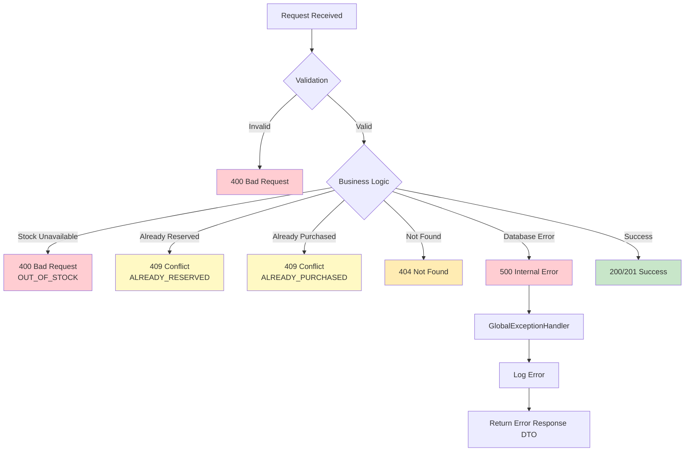

---

## Performance Optimization

### Multi-Level Caching Strategy

```
┌──────────────────────────────────────────────────────┐
│           Read Request Performance Path              │
└──────────────────────────────────────────────────────┘

Request: Get Product Availability (SKU-001)
    │
    ▼
┌────────────────┐
│  L1: Redis     │  ◄── Hit: ~1-5ms
│  stock:SKU-001 │
└────────────────┘
    │ Miss
    ▼
┌────────────────┐
│  L2: Database  │  ◄── Hit: ~10-50ms
│  SELECT *      │      (with connection pool)
│  FROM inventory│
└────────────────┘
    │
    ▼
┌────────────────┐
│  Cache Result  │  ◄── Write-back to Redis
│  in Redis      │      TTL: 5 minutes
└────────────────┘
    │
    ▼
Return to Client

═══════════════════════════════════════════════════════
Write Request Performance Path
═══════════════════════════════════════════════════════

Request: Create Reservation
    │
    ▼
┌────────────────┐
│ Optimistic:    │  ◄── Fast path
│ Decr Redis     │      ~1-5ms
└────────────────┘
    │
    ▼
┌────────────────┐
│ Pessimistic:   │  ◄── Acquire lock
│ DB Lock        │      ~10-100ms
│ SELECT FOR     │      (under contention)
│ UPDATE         │
└────────────────┘
    │
    ▼
┌────────────────┐
│ Update DB      │  ◄── ACID transaction
│ Commit         │      ~5-20ms
└────────────────┘
    │
    ▼
┌────────────────┐
│ Publish Event  │  ◄── Async, non-blocking
│ to Kafka       │      ~1-5ms
└────────────────┘

Total Latency (P95): ~50-150ms
```

---

## Monitoring & Observability

```mermaid
graph TB
    subgraph "Application"
        A[Spring Boot App]
    end

    subgraph "Metrics"
        B[Micrometer]
        C[CloudWatch Metrics]
        D[JVM Metrics]
    end

    subgraph "Logging"
        E[SLF4J/Logback]
        F[Application Logs]
        G[CloudWatch Logs]
    end

    subgraph "Health Checks"
        H[/actuator/health]
        I[Database Health]
        J[Redis Health]
        K[Kafka Health]
    end

    subgraph "Alerting"
        L[High Error Rate Alert]
        M[High Latency Alert]
        N[Low Inventory Alert]
    end

    A --> B
    B --> C
    A --> D
    A --> E
    E --> F
    F --> G
    A --> H
    H --> I
    H --> J
    H --> K
    C --> L
    C --> M
    A --> N

    style C fill:#fce4ec
    style G fill:#fce4ec
    style L fill:#ffcdd2
    style M fill:#ffcdd2
    style N fill:#ffcdd2
```

---

## Key Design Patterns Used

| Pattern | Implementation | Purpose |
|---------|---------------|---------|
| **Repository Pattern** | JPA Repositories | Data access abstraction |
| **Service Layer Pattern** | @Service classes | Business logic encapsulation |
| **DTO Pattern** | Request/Response DTOs | API contract separation |
| **Builder Pattern** | Lombok @Builder | Object construction |
| **Single-Writer Pattern** | Kafka partitioning by SKU | Inventory consistency |
| **Cache-Aside Pattern** | Redis caching | Performance optimization |
| **Optimistic Locking** | JPA @Version | Concurrency control (reads) |
| **Pessimistic Locking** | SELECT FOR UPDATE | Concurrency control (writes) |
| **Event Sourcing** | Kafka events | Audit trail & async processing |
| **Circuit Breaker** | (Future) Resilience4j | Fault tolerance |

---

## Scalability Considerations

```
┌──────────────────────────────────────────────────────┐
│              Horizontal Scaling                      │
└──────────────────────────────────────────────────────┘

         Load Balancer
              │
    ┌─────────┼─────────┐
    │         │         │
  App 1     App 2     App 3    ◄── Stateless instances
    │         │         │
    └─────────┼─────────┘
              │
    ┌─────────┴─────────┐
    │                   │
  Redis            PostgreSQL
 (Cluster)        (Read Replicas)
    │                   │
    │                   │
  Kafka            Kafka
(Partitioned)    (Replicated)

Key Points:
• Stateless application design
• Redis for shared session/cache
• Database read replicas
• Kafka partitioning for parallel processing
• Pessimistic locking prevents overselling
```

---

This documentation provides comprehensive flowcharts and diagrams to understand the Flash Sale application architecture, data flows, and component interactions.
